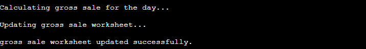
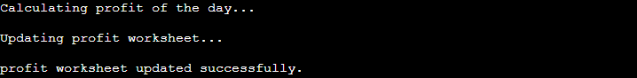

# SALES AUTOMATION SYSTEM

The sales automation system is a system that can be used in any commercial establishment. It calculates the number of sales made each day, the amount of gross sales made and also calculates the value of your net profit for each item and in total based on the cost value informed by each item.

## Demo

A live demo can be found [here](https://third-project-code-institute.herokuapp.com/). The Application was deployes by Heroku.

- - - 

# Contents
* [Technologies Used](#technologies-used)
* [User Experience](#user-experience-ux)
* [Deployment](#deployment)
  * [Heroku Deployment](#heroku-deployment)
  * [Create data model and integrate using an API](#create-data-model-and-integrate-using-an-api)
* [Testing](#testing)
* [Credits](#credits)

- - -

# Technologies Used
## Language
* Python3

## Tools
* Heroku Platform - to deploy the application into live enviroment
* Gitpod - to create the website
* Github - to store the repository of website and deploy it
* Google Sheets API: to handle the data automation.

For this project a [Code Institute template](https://github.com/Code-Institute-Org/python-essentials-template) was used, which provides all the files I needed to run the mock terminal in the browser.

The data of price and cost are collected from each worksheet and the gross sale, quantity and profit are stored in the corresponding worksheet.

# User Experience (UX)

## The ideal users for this website is:
* User who is the owner, manager or supervisor of a commercial establishment. The application facilitates the reading of vital data for the commercial environment

## User stories:

* As a new user, I expetc to easily have an idea of what the program is about.
* I want to be guided and informed how I can enter the information
* I want to have a clear feedback from inputs
* I want to have a clear report of all my essentials data at the end of the market day
* I expect the results be stored somewhere

## How to use:

- The user needs to enter a valid data, that has to be numbers.
- The program will use the data to store in the quantity worsheet.
- The program will calculate the gross sale of the day.
- The program will store the data of gross sale into the worksheet
- The program will calculate the total cost of each product sold.
- The program will store the data of cost into the worksheet
- The program will calculate the profit of the day.
- The program will store the data of profit into the worksheet
- Finally, the system will print a daily report with all the informations needed for the user.

## Existing Features

### Introduction
- Once the user runs the program, the input field is dsplayed.

### Quantity data
- The program will store the quantity data into the worksheet

### Gross Sale data
- The program will calculate the gross sale and store the data into the worksheet

### Cost data
- The program will calculate the cost of the day for each product and store into the worksheet

### Price data
- The program will calculte the profit of the day for each product and store the data into the worksheet

### Daily report
- The program will print a daily report with the usefull information needed for the user

## Future Implementations
- More products on the list
- The user will be able to change the price and the cost without having to change manually in the worksheet

