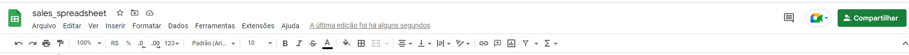

# SALES AUTOMATION SYSTEM

The sales automation system is a system that can be used in any commercial establishment. It calculates the number of sales made each day, the amount of gross sales made and also calculates the value of your net profit for each item and in total based on the cost value informed by each item.


## Demo

A live demo can be found [here](https://third-project-code-institute.herokuapp.com/). The Application was deployes by Heroku.

- - - 

# Contents
* [Technologies Used](#technologies-used)
* [User Experience](#user-experience-ux)
* [Deployment](#deployment)
  * [Heroku Deployment](#heroku-deployment)
  * [Create data model and integrate using an API](#create-data-model-and-integrate-using-an-api)
* [Testing](#testing)

- - -

# Technologies Used
## Language
* Python3

## Tools
* Heroku Platform - to deploy the application into live enviroment
* Gitpod - to create the website
* Github - to store the repository of website and deploy it
* Google Sheets API: to handle the data automation.

For this project a [Code Institute template](https://github.com/Code-Institute-Org/python-essentials-template) was used, which provides all the files I needed to run the mock terminal in the browser.

The data of price and cost are collected from each worksheet and the gross sale, quantity and profit are stored in the corresponding worksheet.




# User Experience (UX)

## The ideal users for this website is:
* User who is the owner, manager or supervisor of a commercial establishment. The application facilitates the reading of vital data for the commercial environment

## User stories:

* As a new user, I expetc to easily have an idea of what the program is about.
* I want to be guided and informed how I can enter the information
* I want to have a clear feedback from inputs
* I want to have a clear report of all my essentials data at the end of the market day
* I expect the results be stored somewhere

## How to use:

- The user needs to enter a valid data, that has to be numbers.
- The program will use the data to store in the quantity worsheet.
- The program will calculate the gross sale of the day.
- The program will store the data of gross sale into the worksheet
- The program will calculate the total cost of each product sold.
- The program will store the data of cost into the worksheet
- The program will calculate the profit of the day.
- The program will store the data of profit into the worksheet
- Finally, the system will print a daily report with all the informations needed for the user.

## Existing Features

### Introduction
- Once the user runs the program, the input field is dsplayed.


### Quantity data
- The program will store the quantity data into the worksheet


### Gross Sale data
- The program will calculate the gross sale and store the data into the worksheet


### Cost data
- The program will calculate the cost of the day for each product and store into the worksheet


### Price data
- The program will calculte the profit of the day for each product and store the data into the worksheet


### Daily report
- The program will print a daily report with the usefull information needed for the user


## Future Implementations
- More products on the list
- The user will be able to change the price and the cost without having to change manually in the worksheet

- - -
# Deployment
Gitpod IDE was used to write the code for this project and the Application has been deployed from GitHub to Heroku using the steps below with version releasing active.

## Heroku Deployment
Deployments steps are as follows, after account setup:

* Select New in the top-right corner of your Heroku Dashboard, and select Create new app from the dropdown menu.
* Add a unique app name and then choose a region closest to you (EU or USA).
* Click on Create App.

In order for the project to run on Heroku, Heroku is needed to install the dependencies. 
* In the terminal write the following commando `pip3 freeze > requirements.txt` to create a list of requirements. The list of dependencies will go into `requirements.txt` file.

The sensitive data needs to be kept secret and Heroku will build the app using the code in the Github. The creds.json file is protected in gitignore file and these credentials are needed in order to connect to API. To allow the Heroku Application to access the spreadsheet the following steps are needed:

* From the new app Settings, click Reveal Config Vars, and set the value of KEY to **CREDS** (all capital letters), and go to the repository, copy the entire`creds.json` then paste it into the VALUE field. Then click "Add".
* Further down, to support dependencies, select Add Buildpack.
* The order of the buildpacks is important, select Python first, then click "Save changes". Then add Node.js second and click "Save changes" again. If they are not in this order, you can drag them to rearrange them.
* Go to "Deploy" and select "GitHub" in "Deployment method".
* To connect Heroku app to your Github repository code enter your repository name, click 'Search' and then 'Connect' when it shows below
* Choose the branch you want to buid your app from.
* If prefered, click on "Enable Automatic Deploys", which keeps the app up to date with your GitHub repository.
* Wait for the app to build. Once ready you will see the “App was successfully deployed” message and a 'View' button to take you to your deployed link.

**Forking the GitHub Repository**
To fork this website to either propose changes or to use as an idea for another website, follow these steps:
1. Login or Sign Up to GitHub.
2. Open the project [repository](https://github.com/lcassis10/third-project).
3. Click the Fork button in the top right corner.
4. Copy of the repository will be in your own GitHub account.

To deploy from GitHub, follow these steps:

1. Log into your GitHub repository, create a GitHub account if necessary.
2. Click 'Settings' in the main Repository menu.
3. Click 'Pages' from the left-hand side navigation menu.
4. Within the Source section, click the "Branch" button and change from 'None' to 'Main'.
5. The page should automatically refresh with a url displayed.
6. Test the link by clicking on the url.

The url for this website can be found [here](https://third-project-code-institute.herokuapp.com/) 

## Create data model and integrate using an API

- **Create a Spreadsheet (Data Model)**

1. Login to your Google account, create an account if necessary.
2. Navigate to Sheets, Googles version of Microsoft Excel.
3. Start a new spreadsheet, amend the title at the top.
4. Create how many Sheets/Tabs/worksheets necessary.

- **Setup API**

1. Navigate to Google Cloud Platform.
2. If you do not already have a profile then follow the basic steps for creating an Account, via clicking on the 'Get Started for Free' button in the upper right corner.
3. Once the previous step is complete, create a new project with a unique title.
4. Click on the "Select Project" button to bring you to your project page.
5. You should now arrive at the project dashboard and be ready to setup the required credentials:
- Access the navigation menu from clicking on the burger icon (three horizonal lines menu icon) in the top left corner of the page.
- Select APIs and Services, followed by 'Library'.
- Search for and select Google Drive API -> Enable.
- Search for and select Google Sheets API -> Enable.
- Click Enable to navigate to 'API and Services Overview'.
- Click Create Credentials in the upper left of the screen.
- For Credential Type, select 'Google Drive' from the dropdown.
- For 'What data will you be accessing' select Application Data.
- For 'Are you planning to use this API with Compute Engine...?' choose 'No, I'm not...'.
- Click Next.
- Within the Create Service Account page, enter a Service Account Name, then click Create.
- Next within 'Grant this service account access to project', choose Basic -> Editor from the 'Select a Role' dropdown and click Continue.
- Next within 'Grant users access to this service account', choose 'Done'.
- On the following, click on the 'Service Account Name' you created to navigate to the config page.
- Navigate to the Keys section.
- Select 'Add Key' dropdown -> Create New Key.
- Select 'JSON' and then click Create. This will trigger the json file with your API credentials in it to download to your machine.
- Go back to the library and search for "google sheets".
- Click Enable.
- From your local downloads folder, add file directly to your Gitpod workspace, and rename the file to creds.json.
- Within the file, copy the value for 'client email'. 
- Paste this email address into the 'Share' area of your Google Sheet, assigning the role of Editor, untick "Notify People" and then click "share".

Enable API within IDE

- From within your GitPod IDE terminal, enter 'pip3 install gspread google-auth'.

- At the top of your Python file add the following lines:
```python
import gspread
from google.oauth2.service_account import Credentials
```

- Below this add the following code:
```phyton
    SCOPE = [
        "https://www.googleapis.com/auth/spreadsheets",
        "https://www.googleapis.com/auth/drive.file",
        "https://www.googleapis.com/auth/drive"
       ]

CREDS = Credentials.from_service_account_file("creds.json")
SCOPED_CREDS = CREDS.with_scopes(SCOPE)
GSPREAD = gspread.authorize(SCOPED_CREDS)
SHEET = GSPREAD.open("sales_spreadsheet")
```
# Testing 
The different aspects of the site work as intended and have an expected outcome providing an easy and straightforward way for the users to achieve their goals.
The terminal was used during the development of the application to identify and resolve any issues as it progressed, testing correct and incorrect user inputs.

## Functionality

### Validator
CI Python Linter was used to validate this project, no errors were returned.


### Manual
- I inserted all types of data into the terminal and the program runs normally when it is a number, and returns the expext ValueError when it is a diferent data type.

## Compatibility
The website displays correctly across different browsers and screen sizes.

## Solved bugs
- The validate_data function was not given the expect result. I converted the values to INT within the try statement and i got the result expected.

## Unfixed bugs
- No unfixed bugs


